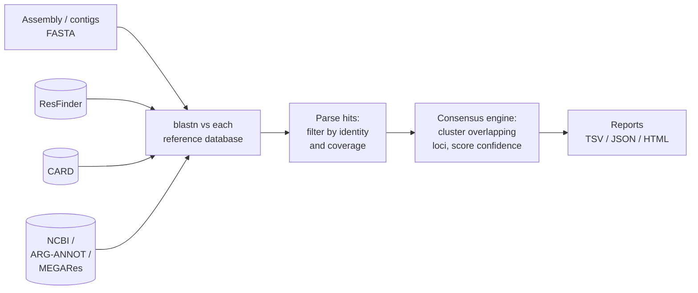

# amr-consensus

**Multi-database consensus detection of antimicrobial resistance (AMR) genes from bacterial assemblies.**

Most AMR detection tools query a single reference database (ResFinder, CARD, or NCBI AMRFinderPlus) and report whatever that database says. In practice, labs often run two or three of these tools and manually cross-check results, because no single database has complete or error-free curation. `amr-consensus` automates that cross-check: it queries multiple databases in one run, reconciles overlapping calls into a single locus-level result, and reports a confidence score based on cross-database agreement and alignment quality.

```bash
amr-consensus run --input my_assembly.fasta --db resfinder,card,ncbi
```

## See it work: data → result

The repo ships with a real end-to-end example — no download or setup required to see it:

- **Input**: [`examples/demo_assembly.fasta`](examples/demo_assembly.fasta) — 6 synthetic contigs built by embedding real ResFinder gene sequences (mutated at controlled rates) into random flanking DNA, simulating an assembly.
- **Reference**: [`examples/demo_reference_db.fasta`](examples/demo_reference_db.fasta) — 6 real AMR genes (blaCTX-M-15, blaTEM-1, mecA, sul1, tet(M), VanHAX).
- **Result**: [`examples/expected_output/`](examples/expected_output/) — the actual TSV/JSON/HTML this pipeline produces from that input, committed to the repo.

| Contig | Gene | Confidence | Identity | Coverage | Drug classes |
|---|---|---|---|---|---|
| contig_1_plasmid_ctxm | blaCTX-M-150 | high (0.996) | 99.09% | 100% | Amoxicillin, Ampicillin, Aztreonam, Cefepime, Cefotaxime, Ceftazidime, Ceftriaxone, Piperacillin, Ticarcillin |
| contig_2_chromosome_mecA | mecA | high (1.0) | 100.0% | 100% | Amoxicillin, Ampicillin, Cefepime, Cefotaxime, Cefoxitin, Ceftazidime, Ertapenem, Imipenem, Meropenem, Piperacillin |
| contig_3_integron_sul1 | sul1 | high (0.98) | 95.07% | 100% | Sulfamethoxazole |
| contig_4_borderline_tetM | tet(M) | high (0.96) | 90.0% | 100% | Doxycycline, Minocycline, Tetracycline |

Two contigs are deliberately *not* in that table: a truncated `blaTEM` fragment (60% coverage — correctly filtered by the `--min-coverage` threshold) and a negative-control contig with no AMR genes at all — proving the thresholds actually work, not just that the tool runs.

Reproduce it yourself in one command:

```bash
./examples/run_demo.sh
```

## Why not just use ABRicate / ResFinder / AMRFinderPlus directly?

Those tools are excellent and `amr-consensus` uses their exact reference databases under the hood — it doesn't reinvent gene curation. What it adds is the layer *above* single-tool output:

- **Reconciliation**: the same resistance locus detected by ResFinder as `blaCTX-M-15` and by CARD as `CTX-M-15` is merged into one call instead of being reported twice.
- **Confidence scoring**: a locus found by 3/3 queried databases at 99% identity is flagged `high` confidence; a locus found by 1/3 databases at 82% identity is flagged `low` — so you know which calls need manual review before acting on them.
- **One consistent report** (TSV / JSON / HTML) regardless of which combination of databases you queried.

## How it works



1. **Detection** (`blast_engine.py`) — runs `blastn` against each requested reference database independently.
2. **Parsing** (`parser.py`) — normalizes hits from every database into one schema (gene, drug class, % identity, % reference coverage) and filters by configurable thresholds (default: ≥80% identity, ≥80% coverage — the community-standard ABRicate/ResFinder defaults).
3. **Consensus** (`consensus.py`) — clusters hits on the same contig with overlapping coordinates into a single locus. Picks the best-scoring allele as the primary gene name (dozens of near-identical alleles from the same gene family, e.g. 90+ `blaCTX-M` variants, collapse into one call with a variant count, not 90 rows). Confidence = weighted combination of how many independent databases agree and the best alignment identity.
4. **Reporting** (`report.py`) — writes a TSV for pipelines, JSON for programmatic use, and a self-contained HTML report for humans.

## Installation

```bash
git clone https://github.com/YOUR_USERNAME/amr-consensus.git
cd amr-consensus
pip install -e .

# BLAST+ is required (not pip-installable):
sudo apt-get install ncbi-blast+   # Debian/Ubuntu
brew install blast                 # macOS
```

Or with Docker:

```bash
docker build -t amr-consensus .
docker run -v $(pwd):/data amr-consensus run --input /data/assembly.fasta --db resfinder,card
```

## Usage

Download reference databases once (cached locally, ~5–10 MB per database):

```bash
amr-consensus setup-db --db resfinder,card
# or: ./scripts/download_db.sh resfinder,card,ncbi,argannot,megares
```

Scan an assembly:

```bash
amr-consensus run \
  --input assembly.fasta \
  --db resfinder,card \
  --outdir results/ \
  --min-identity 90 \
  --min-coverage 80
```

Output:

```
                              AMR Consensus Calls
┏━━━━━━━━━━┳━━━━━━━━━━━┳━━━━━━━━━━┳━━━━━━━━━━┳━━━━━━━━━━┳━━━━━━━━━━━┳━━━━━━━━━━┓
┃ Contig   ┃ Gene(s)   ┃ Confide… ┃ Identity ┃ Coverage ┃ Databases ┃ Drug     ┃
┡━━━━━━━━━━╇━━━━━━━━━━━╇━━━━━━━━━━╇━━━━━━━━━━╇━━━━━━━━━━╇━━━━━━━━━━━╇━━━━━━━━━━┩
│ contig_1 │ blaCTX-M… │ high     │ 99.09%   │ 100.0%   │ resfinder │ Amoxici… │
│          │ (+93)     │ (0.996)  │          │          │           │          │
│ contig_2 │ mecA_1    │ high     │ 100.0%   │ 100.0%   │ resfinder │ Amoxici… │
└──────────┴───────────┴──────────┴──────────┴──────────┴───────────┴──────────┘

Reports written:
  TSV   -> results/amr_consensus_report.tsv
  JSON  -> results/amr_consensus_report.json
  HTML  -> results/amr_consensus_report.html
```

No internet access / air-gapped environment? Use a local reference FASTA instead of downloading:

```bash
amr-consensus run --input assembly.fasta --custom-db-fasta my_local_db.fasta --outdir results/
```

## Supported reference databases

| Database | Source | ~Genes |
|---|---|---|
| ResFinder | Center for Genomic Epidemiology | ~3,200 |
| CARD | Comprehensive Antibiotic Resistance Database | ~6,000 |
| NCBI AMRFinderPlus | NCBI Pathogen Detection | ~8,200 |
| ARG-ANNOT | — | ~2,200 |
| MEGARes | — | ~6,600 |

Reference FASTAs are fetched from the actively-maintained [ABRicate](https://github.com/tseemann/abricate) database mirror, which republishes each source in one consistent header format. Run `amr-consensus list-dbs` to see the current list.

## Interpreting confidence scores

| Confidence | Meaning |
|---|---|
| **high** (≥0.85) | Detected by most/all queried databases at high identity — safe to act on. |
| **medium** (0.6–0.85) | Detected by a subset of databases, or moderate identity — worth a manual look, especially for clinical reporting. |
| **low** (<0.6) | Only one database, lower identity — treat as a candidate, not a confirmed call. |

Score = `0.6 × (databases agreeing / databases queried) + 0.4 × (best % identity / 100)`.

## Testing

The test suite runs entirely offline against bundled fixtures — no network access or full database download required:

```bash
pytest tests/ -v
```

`tests/data/mini_resfinder.fasta` is a 6-gene subset of the real ResFinder database (blaCTX-M-15, blaTEM-1, mecA, sul1, tet(M), VanHAX — spanning beta-lactams, methicillin, sulfonamides, tetracyclines, and glycopeptides). `tests/data/test_assembly.fasta` is a synthetic assembly built by embedding mutated copies of those genes into random flanking sequence, covering: a near-perfect hit, an exact hit, a borderline-identity hit, a coverage-filtered truncated gene, and a negative-control contig with no AMR genes — so the test suite actually validates threshold behavior, not just "does it run."

## Limitations

- Gene-presence detection only — this does not predict phenotypic resistance from point mutations (e.g. gyrA fluoroquinolone-resistance SNPs) or account for gene expression/regulation.
- Consensus clustering is coordinate-based; highly rearranged or fragmented assemblies may under- or over-merge loci.
- Not validated against a clinical reference panel yet — treat results as a research/surveillance aid, not a diagnostic.

## Roadmap

- [ ] Mobile genetic element context (plasmid vs. chromosome) via MOB-suite/PlasmidFinder integration
- [ ] Long-read/hybrid assembly benchmarking (Nanopore error-rate tolerance)
- [ ] Point-mutation resistance calling (e.g. quinolone-resistance-determining regions)
- [ ] Benchmark against a public AMR surveillance dataset with published accuracy numbers

## License

Code: MIT (see [LICENSE](LICENSE)). Reference databases are third-party scientific resources with their own licenses/citation requirements — see [CITATION.cff](CITATION.cff) and cite the upstream databases (ResFinder, CARD, NCBI, ARG-ANNOT, MEGARes) you use in any publication.

## Contributing

See [CONTRIBUTING.md](CONTRIBUTING.md).
